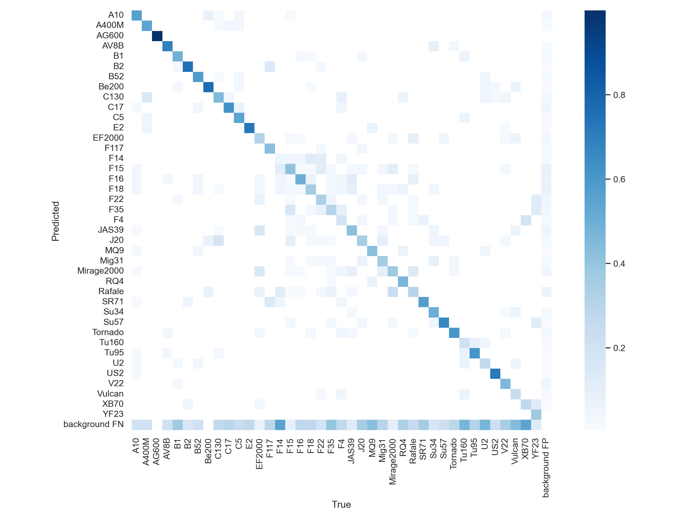
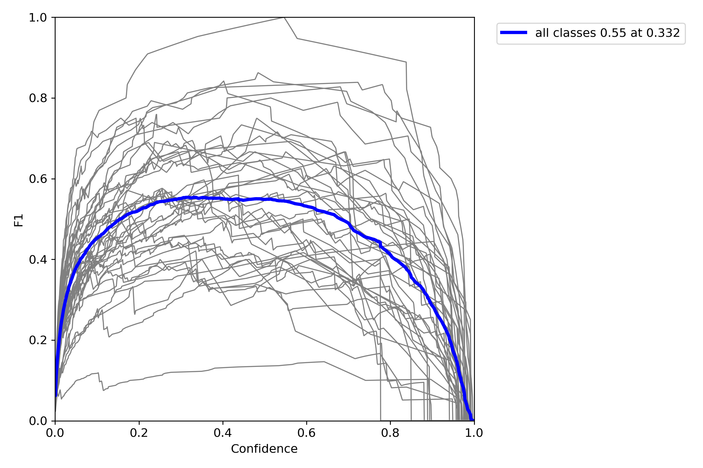
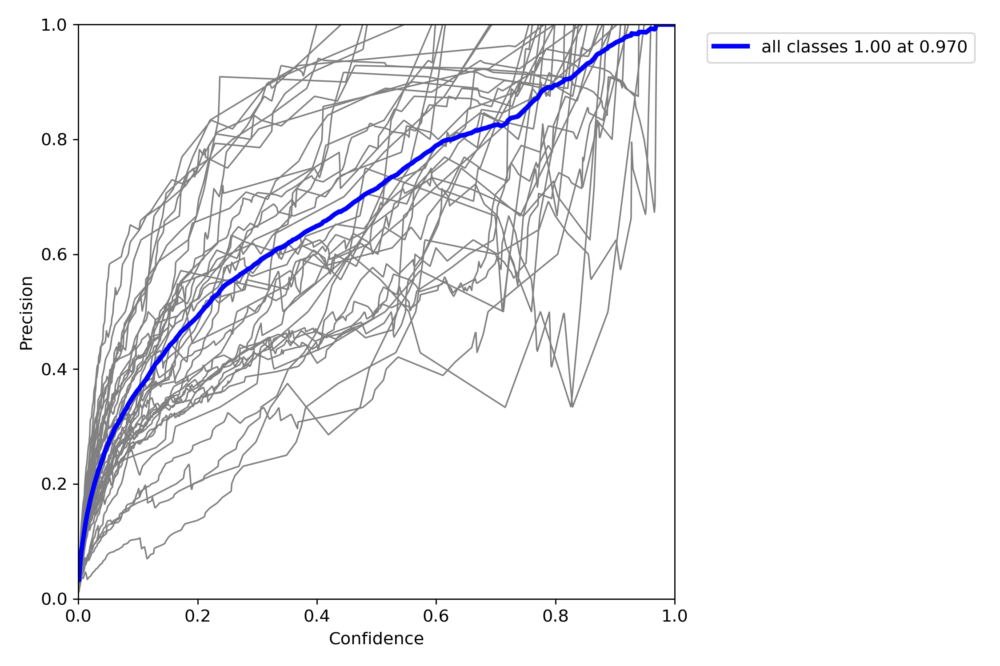
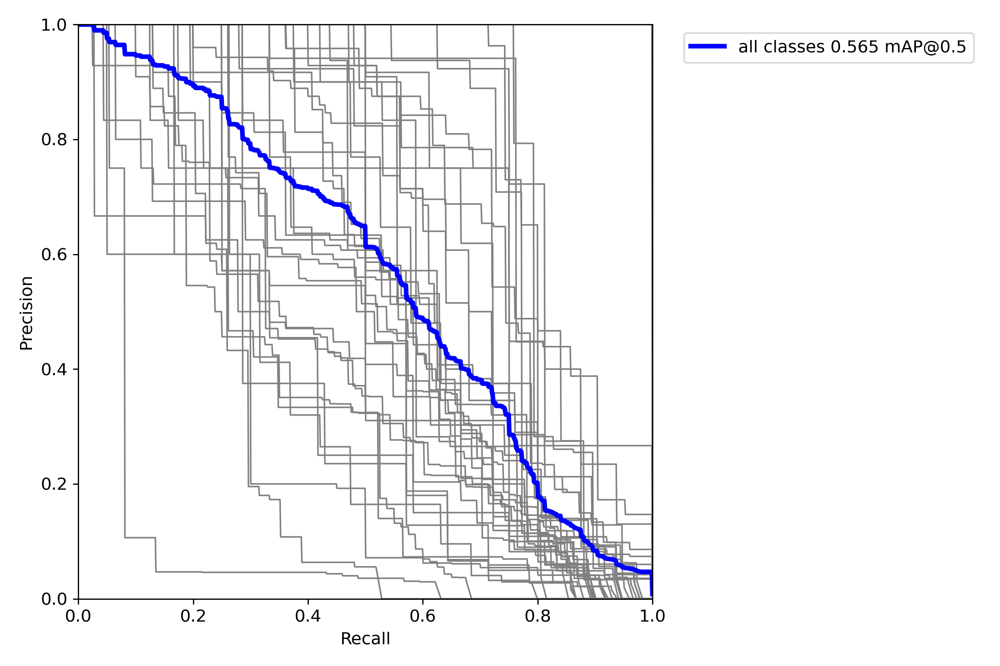
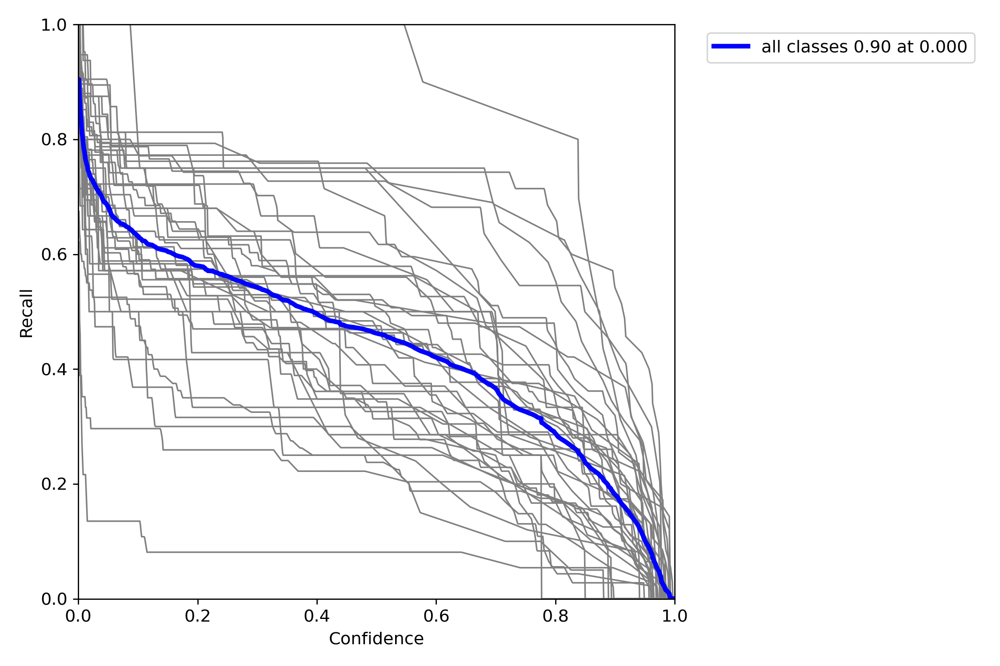

# test-technique

# Installation
Pour installer le projet avec Anaconda :
```
conda create --name plane
conda activate plane
conda install python=3.9
pip install torch torchvision torchaudio --extra-index-url https://download.pytorch.org/whl/cu116
conda env update --file=environment.yml
```

- Télécharger le dossier dataset et le déplacer à la racine du projet, dans le dossier dataset
- Exécuter le notebook train.py jusqu'à l'entraînement compris
- Déplacer le fichier best.pt qui se situe dans yolov7/runs/train/{Dernier entraînement effectué}/weights/ à la racine du projet
- Exécuter le reste du notebook

- Dans un terminal Anaconda, éxécuter la commande ```streamlit run main.py```

# Explications des choix et solutions

### Etape 1 : Choix du modèle
 - Le problème que l'on essaie de résoudre s'appelle Object Detection, l'objectif est de trouver l'endroit où se situe l'objet sur l'image et de le caractériser
 - J'ai choisi d'utiliser le modèle YOLOv7 parce que c'est un modèle très performant, et léger, l'entraînement ne sera donc pas trop long
 - Je me suis donc beaucoup appuyé du git https://github.com/WongKinYiu/yolov7 contenant toutes les informations permettant d'entraîner et de tester un modèle YOLOv7

### Etape 2 : Mise en forme des données
 - Pour travailler avec ce repo, j'ai du remettre en forme les données, d'une part pour les diviser en train/test/valid et d'autre part pour mettre les labels dans le format attendu
 - J'ai utilisé un notebook Jupyter pour prototyper et tester du code rapidement
 - Pour séparer les données, j'ai simplement listé tous les fichiers, mélangé la liste, et découpé les données en 80% train/10% validation/10% test 
 - Ensuite, pour convertir les données au bon format, j'ai lu les documents csv avec pandas, et itéré sur chaque ligne, ce processus peut être grandement accéléré par vectorization, et en parallélisant toutes les traitements parce que les fichiers sont tous indépendants
 - J'ai ensuite sauvegardé les fichiers texte dans leurs dossiers de destination
 - Pour les images, je les redimensionne avec openCV à une taille de 640 x 480 pour qu'elles aient tous la même taille, et pour traiter les données plus rapidement
 - J'ai développé une fonction permettant de faire tout ce processus pour chacune des images et leurs labels respectifs, pour les déplacer dans le bon dossier 

### Etape 3 : Entraînement
 - Pour entraîner le réseau, j'ai créé deux fichiers : planes.yaml, et yolov7_planes-tiny.yaml pour donner à YOLO l'emplacement des données et le nombre de classes, ainsi que l'architecture du modèle que je veux entraîner, j'ai choisi la plus petite, encore pour des problèmes de temps
 - J'ai utilisé une RTX 3070 pour l'entraînement
 - J'ai entraîné le modèle pour 150 époques, et laissé YOLO garder le meilleur modèle en fonction du recall et MAP
 - Avec plus de temps, j'aurais modifié les hyperparamètres du modèles, le modèle utilisé, de la data augmentation, la taille des images d'entrée et la possibilité d'obtenir un modèle qui fonctionne sur plusieurs tailes d'image, puisque les images d'archive sont de tailles diverses.
 - Il existe aussi de nombreux types de modèles pour faire de l'object detection, comme InternImage, ou différents types de R-CNN
 - Pour tester le modèle, j'ai utilisé le fichier test.py du repo, ce qui m'a permis d'avoir les courbes de performances sur le jeu de test, j'ai jugé ces performances acceptables, donc j'ai décidé de passer à l'étape suivante

 
 
 
 
 

 
### Etape 4 : Inférence sur les archives
 - Pour faire l'inférence, il suffit d'appeler le fichier detect.py, en lui donnant le dossier d'archive de base, le meilleur modèle entraîné à l'étape précédente, et un autre paramètre pour sauvegarder les résultats.
 - L'inférence génère un dossier labels, avec pour chaque image, une liste de tous les objets trouvés, avec leur taux de confiance

### Etape 5 : Interface
 - Etant très familier avec Streamlit, j'ai choisi de développer l'interface en utilisant ce framework
 - J'ai interpreté "rechercher dans nos données" comme chercher un ou plusieurs modèles d'avion, et trouver les images correspondant. J'ai aussi ajouté une option pour permettre de décider si on veut plusieurs types d'avions sur une même image
 - Pour pouvoir chercher plusieurs types d'avions en même temps, j'ai utilisé un multiselect, et j'ai fait le lien entre le nom des avions, et les indices renvoyés par YOLO
 - J'ai créé une table pandas contenant tous les objets trouvés sur toutes les images, et je l'ai mise en cache pour avoir un accès plus rapide
 - Pour filtrer les données, j'ai aussi utilisé les fonctions de pandas, une fois le filtrage fait, j'ai affiché toutes les images correspondant à la recherche


